1.2.29
# BrowserStack MCP Server

<div align="center">
 
</div>


<div align="center">
<a href="https://www.npmjs.com/package/@browserstack/mcp-server">

</a>

</div>

<p align="center">Comprehensive Test Platform</p>

<div align="center">
<a href="https://glama.ai/mcp/servers/@browserstack/mcp-server">
  
</a>
</div>

<div>
    <a href="https://www.youtube.com/watch?v=sLA7K9v7qZc&list=PL1vH6dHT3H7oy8w9CY6L_nxGxCc89VXMX&index=5">
      
    </a>
  </div>

  
Manage test cases, execute manual or automated tests, debug issues, and even fix code—directly within tools like Cursor, Claude, or any MCP-enabled client, using plain English.
#### Test from anywhere:
Easily connect the BrowserStack Test Platform to your favourite AI tools, such as IDEs, LLMs, or agentic workflows.
#### Test with natural language:
Manage, execute, debug tests, and even fix code using plain English prompts.
#### Reduced context switching:
Stay in flow—keep all project context in one place and trigger actions directly from your IDE or LLM.

## ⚡️ One Click MCP Setup  

Click on the buttons below to install MCP in your respective IDE:

<a href="http://mcp.browserstack.com/one-click-setup?client=vscode"></a>&nbsp;&nbsp;&nbsp;<a href="http://mcp.browserstack.com/one-click-setup?client=cursor"></a>

#### Note : Ensure you are using Node version >= `18.0` 
- Check your node version using `node --version`. Recommended version: `v22.15.0` (LTS)
- To Upgrade Node :
- 1. On macOS `(Homebrew) - brew update && brew upgrade node  or if using (nvm) - nvm install 22.15.0 && nvm use 22.15.0 && nvm alias default 22.15.0`
- 2. On Windows `(nvm-windows) : nvm install 22.15.0 && nvm use 22.15.0`
- 👉 <a href="https://nodejs.org/en/download" target="_blank">Or directly download the Node.js LTS Installer</a>

.
        
## 💡 Usage Examples

### 📱 Manual App Testing

Test mobile apps on real devices across the latest OS versions. Reproduce bugs and debug crashes without setup hassles.
Below are some sample prompts to use your mobile apps on BrowserStack's extensive cloud of real devices
```bash
# Open app on specific device
"open my app on a iPhone 15 Pro Max"

# Debug app crashes
"My app crashed on Android 14 device, can you help me debug?"
```

- Unlike emulators, test your app's real-world performance on actual devices. With advanced [App-Profiling features](https://www.browserstack.com/docs/app-live/app-performance-testing), you can debug crashes and performance issues in real-time.
- Access all major devices and OS versions from our [device grid](https://www.browserstack.com/list-of-browsers-and-platforms/app_live), We have strict SLAs to provision our global datacenters with newly released devices on [launch day](https://www.browserstack.com/blog/browserstack-launches-iphone-15-on-day-0-behind-the-scenes/).

### 🌐 Manual Web Testing

Similar to the app testing, you can use the following prompts to test your **websites** on BrowserStack's extensive cloud of real browsers and devices. Don't have Edge browser installed on your machine ? We've got you covered!

```bash
# Test your websites
"open my website hosted on localhost:3001 on Edge"
"open browserstack.com on latest version of Chrome"
```

- Test websites across different browsers and devices. We support [every major browser](https://www.browserstack.com/list-of-browsers-and-platforms/live) across every major OS.
- Seamlessly test websites hosted locally on your machine, no need to deploy to a remote server!

### 🧪 Automated Testing (Playwright, Selenium, A11y and more..)

Auto-analyze, diagnose, and even fix broken test scripts right in your IDE or LLM. Instantly fetch logs, identify root causes, and apply context-aware fixes. No more debugging loops.
Below are few example prompts to run/debug/fix your automated tests on BrowserStack's [Test Platform](https://www.browserstack.com/test-platform).

> **Note:** When fetching Root Cause Analysis (RCA) for a test, the server returns the suggested fix as a proposal only. It never applies code changes automatically — your assistant must present the suggestion and wait for your explicit approval before editing any files.

```bash
#Port test suite to BrowserStack
"Setup test suite to run on BrowserStack infra"

#Run tests on BrowserStack
“Run my tests on BrowserStack”

#AI powered debugging of test failures
"My App Automate tests have failed, can you help me fix the new failures?"

```
- Fix test failures reported by your CI/CD pipeline by utilising our industry leading [Test Observability](https://www.browserstack.com/docs/test-observability) features. Find more info [here](https://www.browserstack.com/docs/test-observability/features/smart-tags).
- Run tests written in Jest, Playwright, Selenium, and more on BrowserStack's [Test Platform](https://www.browserstack.com/test-platform)

### 🌐 Accessibility

Catch accessibility issues early with automated, local a11y scans. Get one-click, AI-suggested fixes. No docs hunting, no CI surprises. Ensure WCAG and ADA compliance with our Accessibility Testing tool

```bash
#Scan accessibility issues while development
"Scan & help fix accessibility issues for my website running locally on localhost:3000"

#Scan accessibility issues on production site
“Run accessibility scan & identify issues on my website - www.bstackdemo.com”

```

### 📋 Test Management 

Create and manage test cases, create test plans and trigger test runs using natural language. Below are a few example prompts to utilise capabilities of BrowserStack's [Test Management](https://www.browserstack.com/test-management) with MCP server.

```bash
# Create project & folder structure
"create new Test management project named My Demo Project with two sub folders - Login & Checkout"

# Add test cases
"add invalid login test case in Test Management project named My Demo Project"

# List added test cases 
"list high priority Login test cases from Test Management project - My Demo Project"

# Create test run
"create a test run for Login tests from Test Management project - My Demo Project"

# Update test results
"update test results as passed for Login tests test run from My Demo Project"
```

### 🧪 Access BrowserStack AI agents 

Generate test cases from PRDs, convert manual tests to low-code automation, and auto-heal flaky scripts powered by BrowserStack’s AI agents, seamlessly integrated into your workflow.  Below are few example prompts to access Browserstack AI agents

```bash
#Test case generator agent
"With Browserstack AI, create relevant test cases for my PRD located at /usr/file/location"


#Low code authoring agent
“With Browserstack AI, automate my manual test case X, added in Test Management”


#Self healing agent
“Help fix flaky tests in my test script with Browserstack AI self healing”
```


## 🛠️ Installation

### 📋 Prerequisites for MCP Setup
#### Note : Ensure you are using Node version >= `18.0` 
- Check your node version using `node --version`. Recommended version: `v22.15.0` (LTS)
   
### **One Click MCP Setup**

Click on the buttons below to install MCP in your respective IDE:

<a href="http://mcp.browserstack.com/one-click-setup?client=vscode"></a>&nbsp;&nbsp;&nbsp;<a href="http://mcp.browserstack.com/one-click-setup?client=cursor"></a>

### **Alternate ways to Setup MCP server**

1. **Create a BrowserStack Account**

   - Sign up for [BrowserStack](https://www.browserstack.com/users/sign_up) if you don't have an account already.

   - ℹ️ If you have an open-source project, we'll be able to provide you with a [free plan](https://www.browserstack.com/open-source).
   

   - Once you have an account (and purchased appropriate plan), note down your `username` and `access_key` from [Account Settings](https://www.browserstack.com/accounts/profile/details).

2. #### Note : Ensure you are using Node version >= `18.0` 
    - Check your node version using `node --version`. Recommended version: `v22.15.0` (LTS)
   

3. **Install the MCP Server**

   - VSCode (Copilot - Agent Mode): `.vscode/mcp.json`:
    
      - Locate or Create the Configuration File: 
        In the root directory of your project, look for a folder named .vscode. This folder is usually hidden so you will need to find it as mentioned in the expand.
    
      - If this folder doesn't exist, create it.
    
      - Inside the .vscode folder, create a new file named mcp.json
      
      - Add the Configuration: Open the mcp.json file and then add the  following JSON content. 
      
      - Replace the username and <access_key> with your BrowserStack   credentials.

   ```json
   {
     "servers": {
       "browserstack": {
         "command": "npx",
         "args": ["-y", "@browserstack/mcp-server@latest"],
         "env": {
           "BROWSERSTACK_USERNAME": "<username>",
           "BROWSERSTACK_ACCESS_KEY": "<access_key>"
         }
       }
     }
   }
   ```

   - In VSCode, make sure to click on `Start` button in the MCP Server to start the server.
     

   
   #### ** Alternate way to setup MCP on VSCode Copilot

   1.Click on the gear icon to Select Tools
    <div align="center">
      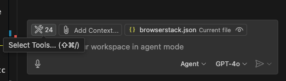 
    </div>
   2. A tool menu would appear at the top-centre, scroll down on the     menu at the top and then Click on Add MCP Server
    <div align="center">
      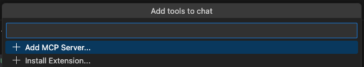 
    </div>
   3. Select NPM package option (Install fron an NPM package) - 3rd in the list
    <div align="center">
      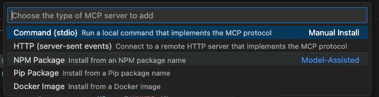 
    </div>
   4. Enter NPM Package Name (@browserstack/mcp-server)
    <div align="center">
      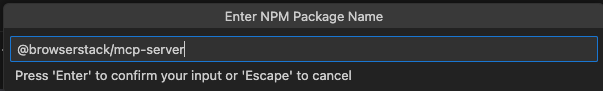 
    </div>
   5. Enter browserstack user name and access key
   
   
   
   
   * For Cursor: `.cursor/mcp.json`:

   ```json
   {
     "mcpServers": {
       "browserstack": {
         "command": "npx",
         "args": ["-y", "@browserstack/mcp-server@latest"],
         "env": {
           "BROWSERSTACK_USERNAME": "<username>",
           "BROWSERSTACK_ACCESS_KEY": "<access_key>"
         }
       }
     }
   }
   ```

   - Claude Desktop: `~/claude_desktop_config.json`:

   ```json
   {
     "mcpServers": {
       "browserstack": {
         "command": "npx",
         "args": ["-y", "@browserstack/mcp-server@latest"],
         "env": {
           "BROWSERSTACK_USERNAME": "<username>",
           "BROWSERSTACK_ACCESS_KEY": "<access_key>"
         }
       }
     }
   }
   ```
   - Cline
     
Click the “MCP Servers” icon in the navigation bar
Select the “Installed” tab. Click the “Configure MCP Servers” button at the bottom of the pane.

   ```json
   {
     "mcpServers": {
       "browserstack": {
         "command": "npx",
         "args": ["-y", "@browserstack/mcp-server@latest"],
         "env": {
           "BROWSERSTACK_USERNAME": "<username>",
           "BROWSERSTACK_ACCESS_KEY": "<access_key>"
         }
       }
     }
   }
   ```

### 💡 List of BrowserStack MCP Tools

As of now we support 44 tools.

> **Remote MCP note:** Tools marked _(not available in Remote MCP)_ rely on local file/process state and are disabled in the multi-tenant [Remote MCP Server](#-remote-mcp-server). They are available in the local (npx) setup.

---

## 🧾 Test Management

 1. `createProjectOrFolder` — Create a Test Management project and/or folders to organize test cases. Returns with Folder ID, Project ID and Test Management Link to access the TM Project Dashboard.
  **Prompt example**

  ```text
  Create a new Test Management project named 'Shopping App' with two folders - Login and Checkout
  ```


 2. `createTestCase` — Add a manual test case under a specific project/folder (uses project identifier like PR-xxxxx and a folder ID).
  **Prompt example**

  ```text
  Add a test case named 'Invalid Login Scenario' to the Login folder in the 'Shopping App' project with PR-53617, Folder ID: 117869
  ```

 3. `updateTestCase` — Update an existing test case. Any subset of fields may be changed (name, priority, status, steps, tags, etc.); only supplied fields are modified.
  **Prompt example**

  ```text
  Update test case TC-482 in the 'Shopping App' project and set its priority to high
  ```

 4. `listTestCases` — List test cases for a project, optionally scoped to a folder (supports filters like case_type, priority, and pagination).
  **Prompt example**

  ```text
  List all high-priority test cases in the 'Shopping App' project with project_identifier: PR-59457
  ```

 5. `listFolders` — List folders in a Test Management project (returns each folder's id, name, case counts, and sub-folder counts). Pass a parent_id to list sub-folders.
  **Prompt example**

  ```text
  List all folders in the 'Shopping App' project with project_identifier: PR-59457
  ```

 6. `listTestCaseTemplates` — List test-case templates with their numeric template_id, for use with `createTestCase` to apply a custom template.
  **Prompt example**

  ```text
  List the available test case templates in the 'Shopping App' project
  ```

 7. `createTestRun` — Create a test run (suite) for selected test cases in a project.
  **Prompt example**

  ```text
  Create a test run for the Login folder in the 'Shopping App' project and name it 'Release v1.0 Login Flow'
  ```

 8. `listTestRuns` — List test runs for a project (filter by dates, assignee, state).
  **Prompt example**

  ```text
  List all test runs from the 'Shopping App' project that were executed last week and are currently marked in-progress
  ```

 9. `updateTestRun` — Update a test run's name/state and/or add test cases to it.
  **Prompt example**

  ```text
  Update test run ID 1043 in the 'Shopping App' project and mark it as complete with the note 'Regression cycle done'
  ```

 10. `addTestResult` — Add a manual execution result (passed/failed/blocked/skipped) for a test case within a run.
  **Prompt example**

  ```text
  Mark the test case 'Invalid Login Scenario' as passed in test run ID 1043 of the 'Shopping App' project
  ```

 11. `createTestCasesFromFile` — Generate test cases in bulk from an uploaded file using the Test Case Generator AI Agent. _(not available in Remote MCP)_
  **Prompt example**

  ```text
  Upload test cases from '/Users/xyz/testcases.pdf' to the 'Shopping App' project in Test Management
  ```

 12. `listTestPlans` — List test plans (TP-*) in a project, with name, status, dates, and active/closed run counts. Supports pagination.
  **Prompt example**

  ```text
  List all test plans in the 'Shopping App' project with project_identifier: PR-59457
  ```

 13. `getTestPlan` — Fetch a test plan by identifier (TP-*) with its metadata, linked test runs, total test-case count, and status summary.
  **Prompt example**

  ```text
  Get the details of test plan TP-120 in the 'Shopping App' project
  ```

 14. `listSubTestPlans` — List sub-test-plans (STP-*) under a parent test plan (TP-*). Supports pagination.
  **Prompt example**

  ```text
  List sub-test-plans under test plan TP-120 in the 'Shopping App' project
  ```

 15. `getSubTestPlan` — Fetch a sub-test-plan (STP-*) under a parent plan, with its metadata and linked test runs.
  **Prompt example**

  ```text
  Get sub-test-plan STP-45 under test plan TP-120 in the 'Shopping App' project
  ```

---

## ⚙️ BrowserStack SDK Setup / Automate Test

 16. `setupBrowserStackAutomateTests` — Integrate BrowserStack SDK and run web tests on BrowserStack. For visual testing/Percy, use the dedicated Percy tools.
  **Prompt example**

  ```text
  Run my Selenium-JUnit5 tests written in Java on Chrome and Firefox.
  ```

 17. `fetchAutomationScreenshots` — Fetch screenshots captured during a given Automate/App Automate session.
  **Prompt example**

  ```text
  Get screenshots from Automate session ID abc123xyz for my desktop test run
  ```

---

## 🔍 Observability

 18. `getFailureLogs` — Retrieve error logs for Automate/App Automate sessions (optionally by Build ID for App Automate).
  **Prompt example**

  ```text
  Get the error logs from the session ID: 21a864032a7459f1e7634222249b316759d6827f, Build ID: dt7ung4wmjittzff8kksrjadjax9gzvbscoyf9qn of App Automate test session
  ```

 19. `fetchBuildInsights` — Fetch insights about a BrowserStack build by combining build details and quality-gate results.
  **Prompt example**

  ```text
  Get the build insights for build UUID <your-build-uuid> on BrowserStack
  ```

---

## 📱 App Live

 20. `runAppLiveSession` — Start a manual app testing session on a real device in the cloud.
  **Prompt example**

  ```text
  Open my app on iPhone 15 Pro Max with iOS 17. App path is /Users/xyz/app.ipa
  ```

---

## 💻 Live

 21. `runBrowserLiveSession` — Start a Live session for website testing on desktop or mobile browsers.
  **Prompt example**

  ```text
  Open www.google.com on the latest version of Microsoft Edge on Windows 11
  ```

---

## 📲 App Automate

 22. `takeAppScreenshot` — Launch the app on a specified device and capture a quick verification screenshot to confirm your app has launched.
  **Prompt example**

  ```text
  Take a screenshot of my app on Google Pixel 6 with Android 12 while testing on App Automate. App file path: /Users/xyz/app-debug.apk
  ```

 23. `runAppTestsOnBrowserStack` — Run pre-built native mobile test suites (Espresso/XCUITest) by direct upload of compiled .apk/.ipa test files.
  **Prompt example**

  ```text
  Run Espresso tests from /tests/checkout.zip on Galaxy S21 and Pixel 6 with Android 12. App path is /apps/beta-release.apk under project 'Checkout Flow'
  ```

 24. `setupBrowserStackAppAutomateTests` — Set up BrowserStack App Automate SDK integration for Appium-based mobile app testing.
  **Prompt example**

  ```text
  Set up my Appium test suite to run on BrowserStack App Automate
  ```

---

## ♿ Accessibility

 25. `accessibilityExpert` — Ask the A11y Expert (WCAG 2.0/2.1/2.2, mobile/web usability, best practices).
  **Prompt example**

  ```text
  What WCAG guidelines apply to form field error messages on mobile web?
  ```

 26. `startAccessibilityScan` — Start a web accessibility scan and retrieve a local CSV report path.
  **Prompt example**

  ```text
  Run accessibility scan for "www.example.com"
  ```

 27. `createAccessibilityAuthConfig` — Create an authentication configuration (form-based or basic) for accessibility scans behind a login.
  **Prompt example**

  ```text
  Create a basic-auth accessibility config named 'site-login' for https://www.example.com with username testuser and password <password>
  ```

 28. `getAccessibilityAuthConfig` — Retrieve an existing accessibility authentication configuration by ID.
  **Prompt example**

  ```text
  Get accessibility auth config with ID <config-id>
  ```

 29. `fetchAccessibilityIssues` — Fetch accessibility issues from a completed scan, with pagination support.
  **Prompt example**

  ```text
  Fetch the accessibility issues for scan ID <scan-id> and scan run ID <scan-run-id>
  ```

---

## 🎨 Percy Visual Testing

 30. `percyVisualTestIntegrationAgent` — Integrate Percy visual testing into a new project and demonstrate visual change detection with a step-by-step simulation.
  **Prompt example**

  ```text
  Integrate Percy for this project
  ```

 31. `expandPercyVisualTesting` — Set up or expand Percy visual testing coverage for existing projects (Percy Web Standalone and Percy Automate).
  **Prompt example**

  ```text
  Expand Percy coverage for this project
  ```

 32. `addPercySnapshotCommands` — Add Percy snapshot commands to the specified test files. _(not available in Remote MCP)_
  **Prompt example**

  ```text
  Add Percy snapshot commands to my Cypress test files
  ```

 33. `listTestFiles` — List all test files for a given set of directories. _(not available in Remote MCP)_
  **Prompt example**

  ```text
  List the test files under my ./tests directory
  ```

 34. `runPercyScan` — Run a Percy visual test scan. _(not available in Remote MCP)_
  **Prompt example**

  ```text
  Run this Percy build
  ```

 35. `fetchPercyChanges` — Retrieve and summarize visual changes detected by Percy AI between the latest and previous builds.
  **Prompt example**

  ```text
  Summarize the visual changes Percy detected in my latest build
  ```

 36. `managePercyBuildApproval` — Approve or reject a Percy build.
  **Prompt example**

  ```text
  Approve the latest Percy build
  ```

---

## 🤖 BrowserStack AI Agents

 37. `uploadProductRequirementFile` — Upload a PRD/screenshot/PDF and get a file mapping ID (used with `createTestCasesFromFile`). _(not available in Remote MCP)_
  **Prompt example**

  ```text
  Upload PRD from /Users/xyz/Desktop/login-flow.pdf and use BrowserStack AI to generate test cases
  ```

 38. `createLCASteps` — Generate Low Code Automation (LCA) steps from a manual test case in Test Management.
  **Prompt example**

  ```text
  Convert the manual test case 'Add to Cart' in the 'Shopping App' project into LCA steps
  ```

 39. `fetchSelfHealedSelectors` — Retrieve AI self-healed selectors (plus test source) to fix flaky tests caused by DOM changes.
  **Prompt example**

  ```text
  Fetch and fix flaky test selectors in Automate session ID session_9482 using MCP
  ```

 40. `prepareSelfHealingPlan` — Build a self-healing edit plan that bundles locator pairs with test source for your LLM to apply. Does NOT modify files itself.
  **Prompt example**

  ```text
  Prepare a self-healing plan from the self-healed selectors for my build
  ```

 41. `fetchRCA` — Fetch AI Root Cause Analysis for your failed Automate/App-Automate tests (by numeric test ID). Suggests fixes only; never auto-applies.
  **Prompt example**

  ```text
  Fetch the root cause analysis for failed test IDs 101 and 102 on BrowserStack
  ```

 42. `getBuildId` — Get the BrowserStack build ID for a given project and build name, scoped to your builds.
  **Prompt example**

  ```text
  Get the build ID for build 'nightly-regression' in project 'Checkout Flow'
  ```

 43. `listBuildId` — Get the latest build ID for a project and build name, across all users (no user filter).
  **Prompt example**

  ```text
  Get the latest build ID for build 'nightly-regression' in project 'Checkout Flow'
  ```

 44. `listTestIds` — List test IDs from a BrowserStack Automate build, filtered by status (passed/failed/pending/skipped).
  **Prompt example**

  ```text
  List the failed test IDs from build UUID <your-build-uuid> on BrowserStack
  ```

##  🚀 Remote MCP Server

Remote MCP comes with all the functionalities of an MCP server without the hassles of complex setup or local installation.

### Key benefits:

- ✅ Works seamlessly in enterprise networks without worrying about firewalls or binaries or where local installation is not allowed.

- ✅ Secure OAuth integration – no password sharing or manual credential handling.

### Limitations:

- ❌ No Local Testing support (cannot test apps behind VPNs, firewalls, or localhost). If you have to do Local Testing, you would have to use a BrowserStack Local MCP server.
- ❌ Latency can be slightly higher, but nothing considerable — you generally won’t notice it in normal use.

### Installation Steps: 

   - On VSCode (Copilot - Agent Mode): `.vscode/mcp.json`:
    
      - Locate or Create the Configuration File:
      - In the root directory of your project, look for a folder named .vscode. This folder is usually hidden so you will need to find it as            mentioned in the expand.
      - If this folder doesn't exist, create it.
      - Inside the .vscode folder, create a new file named mcp.json
      - To setup Remote BrowserStack MCP instead of local BrowserStack MCP you can add the following JSON content :
         <div align="center">
         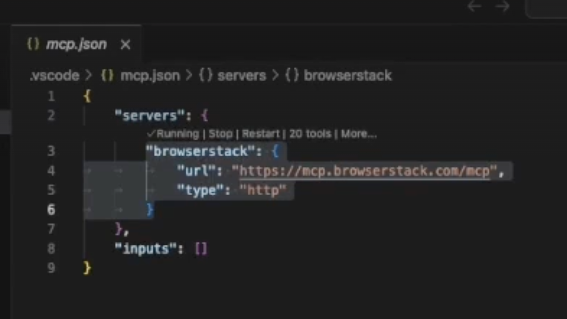
         </div>
        
        ### Alternative way to Setup Remote MCP

      -  Step 1.Click on the gear icon to Select Tools
      
          <div align="center">
           
          </div>
          
      -  Step 2. A tool menu would appear at the top-centre, scroll down on the menu at the top and then Click on Add MCP Server
      
        <div align="center">
         
        </div>

      - Step 3. Click on HTTP option
         <div align="center">
         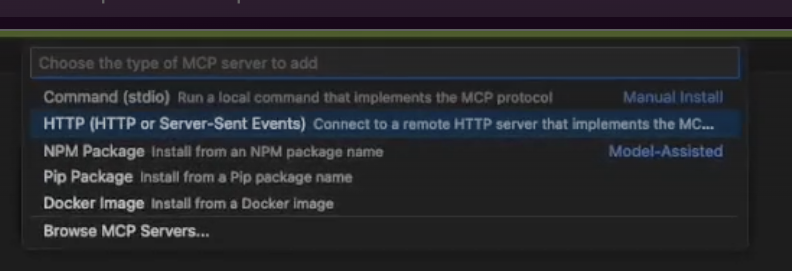
         </div>
         
      - Step 4. Paste Remote MCP Server URL : https://mcp.browserstack.com/mcp
         <div align="center">
         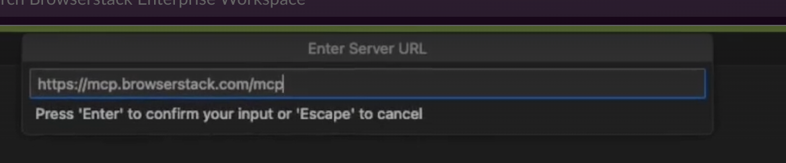
         </div>
         
      - Step 5. Give server id as : browserstack
      
          <div align="center">
          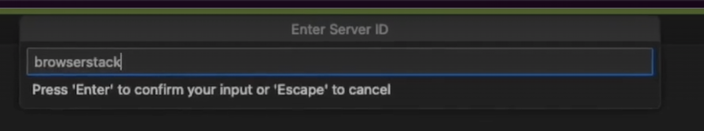
          </div>
          
      - Step 6. In VSCode Click on start MCP Server and then click on "Allow"
      
          <div align="center">
          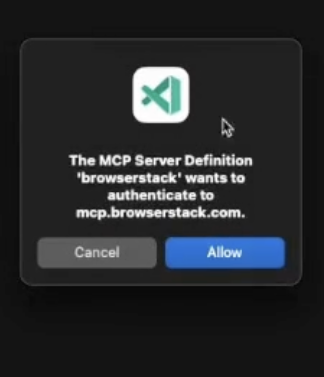
          </div>
          
          <div align="center">
          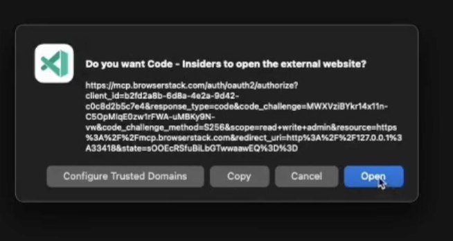
          </div>
          
          <div align="center">
          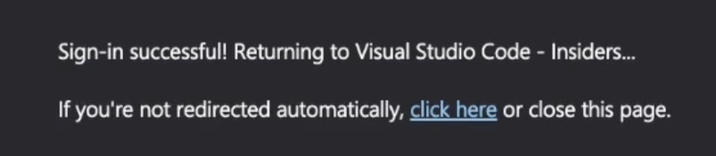
          </div>

     

## 🤝 Recommended MCP Clients

- We recommend using **Github Copilot or Cursor** for automated testing + debugging use cases.
- For manual testing use cases (Live Testing), we recommend using **Claude Desktop**.

## ⚠️ Important Notes

- The BrowserStack MCP Server is under active development and currently supports a subset of the MCP spec. More features will be added soon.
- Tool invocations rely on the MCP Client which in turn relies on an LLM, hence there can be some non-deterministic behaviour that can lead to unexpected results. If you have any suggestions or feedback, please open an issue to discuss.

## 📝 Contributing

We welcome contributions! Please open an issue to discuss any changes you'd like to make.
👉 [**Click here to view our Contributing Guidelines**](https://github.com/browserstack/mcp-server/blob/main/CONTRIBUTING.md)

## 📞 Support

For support, please:

- Open an issue in our [GitHub repository](https://github.com/browserstack/mcp-server) if you face any issues related to the MCP Server.
- Contact our [support team](https://www.browserstack.com/contact) for any other queries.

## 🚀 More Features Coming Soon

Stay tuned for exciting updates! Have any suggestions? Please open an issue to discuss.
