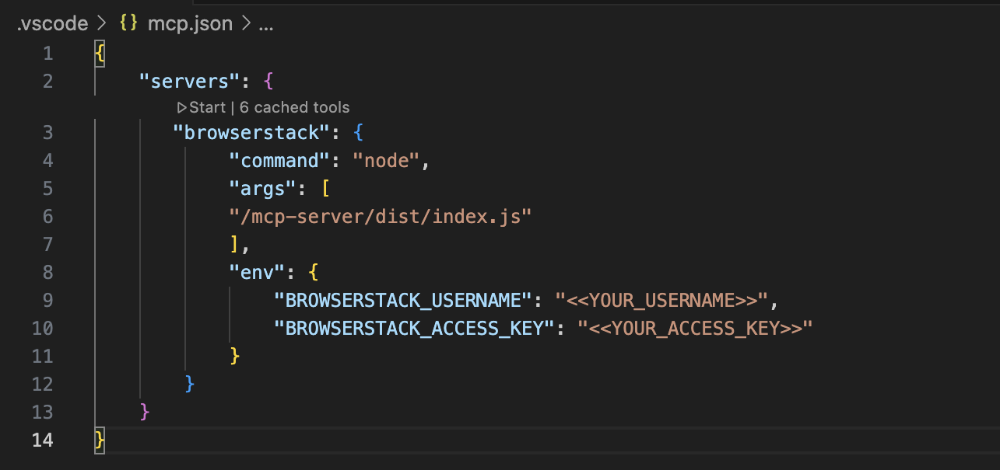

# 🚀 Contributing to the Browserstack MCP Server

This guide will help you set up your environment and contribute effectively to the MCP (Model Context Protocol) Server.

## ✅ Prerequisites

Make sure you have the following installed:

- 🟢 [Node.js](https://nodejs.org/)
- 📦 [npm](https://www.npmjs.com/)
- 📝 TypeScript
- 🤖 GitHub Copilot (for VS Code or Cursor)
- 🧠 Optionally, [Claude desktop app](https://www.anthropic.com/index/claude-desktop) for AI assistance

## 🛠 Getting Started

1. **Clone the repository:**

   ```bash
   git clone https://github.com/browserstack/mcp-server.git
   cd mcp-server
   ```

2. **Build the project:**

   ```bash
   npm run build
   ```

   This compiles the TypeScript source code and generates `dist/index.js`.

3. **Configure MCP for your editor:**

### 💻 VS Code: `.vscode/mcp.json`

```json
{
  "servers": {
    "browserstack": {
      "command": "node",
      "args": ["FULL PATH TO dist/index.js"],
      "env": {
        "BROWSERSTACK_USERNAME": "<your_username>",
        "BROWSERSTACK_ACCESS_KEY": "<your_access_key>"
      }
    }
  }
}
```

### 🖱 Cursor: `.cursor/mcp.json`

```json
{
  "mcpServers": {
    "browserstack": {
      "command": "node",
      "args": ["FULL PATH TO dist/index.js"],
      "env": {
        "BROWSERSTACK_USERNAME": "<your_username>",
        "BROWSERSTACK_ACCESS_KEY": "<your_access_key>"
      }
    }
  }
}
```
### 🔨 Quick Start from VS Code or Cursor

When you open your `.vscode/mcp.json` or `.cursor/mcp.json` file,  
you'll see a **"play" icon** (▶️) next to the server configuration.  
**Click it to instantly start your MCP server!**

*(See the image below for reference:)*  
<div align="center">

</div>

---

## 🧪 How to Test with MCP Inspector

**MCP Inspector** is a developer tool for testing and debugging MCP servers — it's the best way to validate your server implementation.

### 🔹 Basic Usage

```bash
npx @modelcontextprotocol/inspector node dist/index.js
```

This will start the server on:  
[http://127.0.0.1:6274](http://127.0.0.1:6274)

### 🔸 Using a Config File

If you've set up a `.cursor/mcp.json` or `.vscode/mcp.json` config, you can run:

```bash
npx @modelcontextprotocol/inspector --config /PATH_TO_CONFIG/.cursor/mcp.json --server browserstack
```

This will automatically fill all the required values.


## ✨ Next Steps

🌀 Fork the repository to your GitHub account

🧩 Add tests to verify your contributions

🤖 Explore and interact with the server using Copilot, Cursor, or Claude

📬 Raise a pull request from your fork once you're ready!
